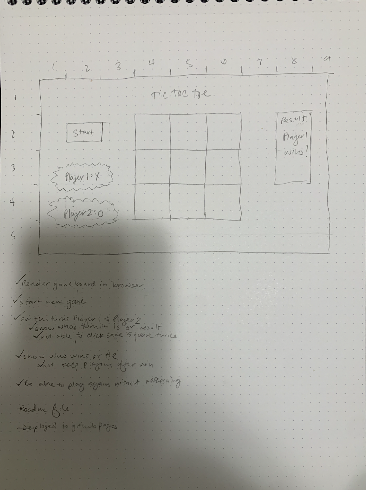

# Tic Tac Toe

## Overview
To create an online game where two people can play tic tac toe. 

## User Stories
- Users should be able to go to a website to play a game (or more) of tic tac toe together. 
- Users are able to press a button to start a new game. 
- The site shows the users which player's turn it is. 
- When it is a particular player's turn, they are able to click on a space on the board and have it change to reflect their choice. 
- A player is not able to select a space that has already been chosen. 
- If a player accomplishes three in a row, then they are shown as the winner in the results section. 
- If neither player has accomplished three in a row after nine spaces have been selected, then a tie is shown in the results section.
- At the end the game, the users are able to play another game if they wish. 

## Technologies Used
- Formatting of the page and styling were accomplished in HTML and CSS.
- JavaScript was used to determine the flow of play and results of the game.

## Approach Taken
1. I first wireframed the basic view of the screen (desktop version) I wanted to display. 

2. I then entered the elements and text into an HTML index file. 
3. Then I utilized a grid in CSS to get my controls on the left hand side and the game board on the right side. Later on I added in a media query to the CSS so that the controls section would be above the gameboard on smaller screens.
4. I then worked in the JavaScript file so that the game could be played. First I added event listeners so that when a user clicked on a space, a class would be added and the styling for that class would be applied to that element. Then I added in logic to check whether or not that player had won by comparing the innerHTML of possible three-in-a-rows. If there was no winner, then the game would continue until one player had accomplished three in a row or all spaces had been played. That result would then be shown in the results section, and the games won tally would be updated for that player as well. After a game has ended, the players would have the option of starting a new game. 

## Possible Future Updates
- The ability to play against a computer.
- The ability to complete against another player online. 

## Installation and Use
- The game can be played online at: http://www.abbyhenes.com/tictactoe/
- The repository for the game can be accessed on [GitHub](https://github.com/dinowaffles/tictactoe). Feel free to fork this respository, then clone it locally to customize it to your preferences!
